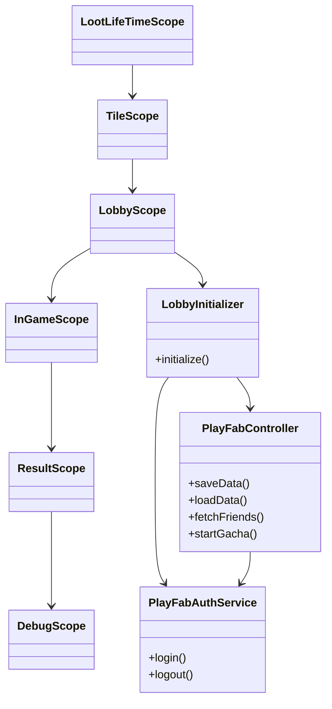
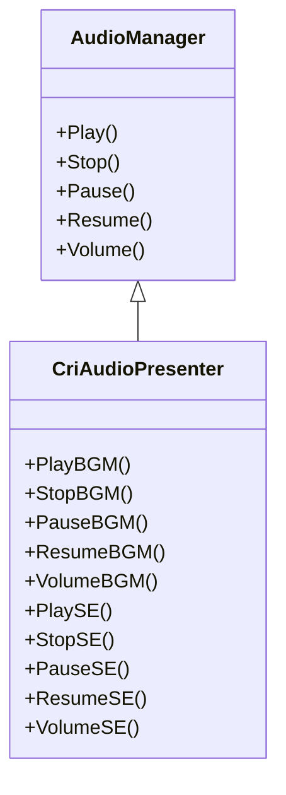

# GameServerTest

## AudioManager
AudioManagerは、オーディオ関連の基本的な操作と管理を行うクラスです。このクラスの主な責任は、オーディオリソースの管理、オーディオの再生、停止、ボリューム調整などの基本機能を提供することです。具体的には以下のような機能を提供します：

オーディオリソースの初期化：

キューシートの読み込みと管理
各種プレイヤーの初期化
基本的なオーディオ操作：

再生（Play）
停止（Stop）
一時停止（Pause）
再開（Resume）
ボリューム調整（Volume）
リスナーの設定：

3Dオーディオリスナーの設定
リソース管理：

Disposeメソッドによるリソースのクリーンアップ

## CriAudioPresenter
CriAudioPresenterは、AudioManagerのラッパーとして機能し、プレゼンテーションロジックを提供します。このクラスは、AudioManagerを使いやすくし、より高レベルの操作を提供するためのものです。具体的には以下のような機能を提供します：

高レベルのオーディオ操作：

AudioManagerのメソッドをラップし、呼び出しを簡素化する
必要に応じて追加のプレゼンテーションロジックを追加
依存関係の管理：

VContainerを使用してAudioManagerの依存関係を注入し、クラス間の結合度を低減
エディタとの統合：

エディタ拡張で使用される場合、エディタUIとの連携を簡素化する

## 環境

- Unity
  - URP
- UniTask
- UniRx
- VContainer
- Photon
- PlayFab

CriAudioPresenterは、AudioManagerのラッパーとして機能し、プレゼンテーションロジックを提供します。このクラスは、AudioManagerを使いやすくし、より高レベルの操作を提供するためのものです。具体的には以下のような機能を提供します：

高レベルのオーディオ操作：

AudioManagerのメソッドをラップし、呼び出しを簡素化する
必要に応じて追加のプレゼンテーションロジックを追加
依存関係の管理：

